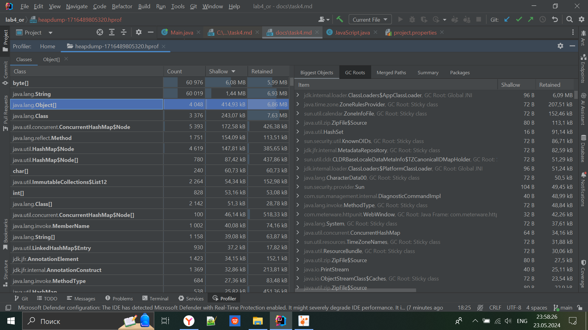

Для начала из кода уберём задержку, чтобы быстрее увидеть, в чём заключается проблема

```java
    while(true){
        WebRequest request = new GetMethodWebRequest("http://test.meterware.com/myServlet");
        WebResponse response = sc.getResponse(request);
                System.out.
        
        println("Count: "+number+++response);
        // java.lang.Thread.sleep(200); // задержка
    }
```

Запустив профилировщик `VisualVM` мы увидим утечку данных кучи.


Для того, чтобы понять, где происходит утечка давайте сохраним `Heap Dump`.

[//]: # ()

[//]: # (Выберем вкладку `Objects`)

[//]: # (![img_1.png]&#40;images/img_1.png&#41;)

Откроем в IDEA, тк там удобнее

Тут отсортируем по количеству используемой памяти.


Сначала мы открыли `byte[]` и `String`, но ничего интересного там не нашли.
Затем перешли во вкладку `Object[]`, и там заметили странный item и 47427 элементов. Звучит как утечка данных.

Если развернуть этот блок, от увидем множество повторяющихся сообщений с текстом из сервлета.
Также там будут сообщения об ошибке, которые говорят об неопределённой функции `document.wr('Hello Document');`

И правда такого метода нет, но зато есть `document.write('Hello Document')`, которая делает именно то, что нужно.

Давайте заменим её и посмотрим на результат.


Видно, что после 5 минут работы всё стабильно.

И в `Heap Dump` так же отсутвует те 47427 объектов


